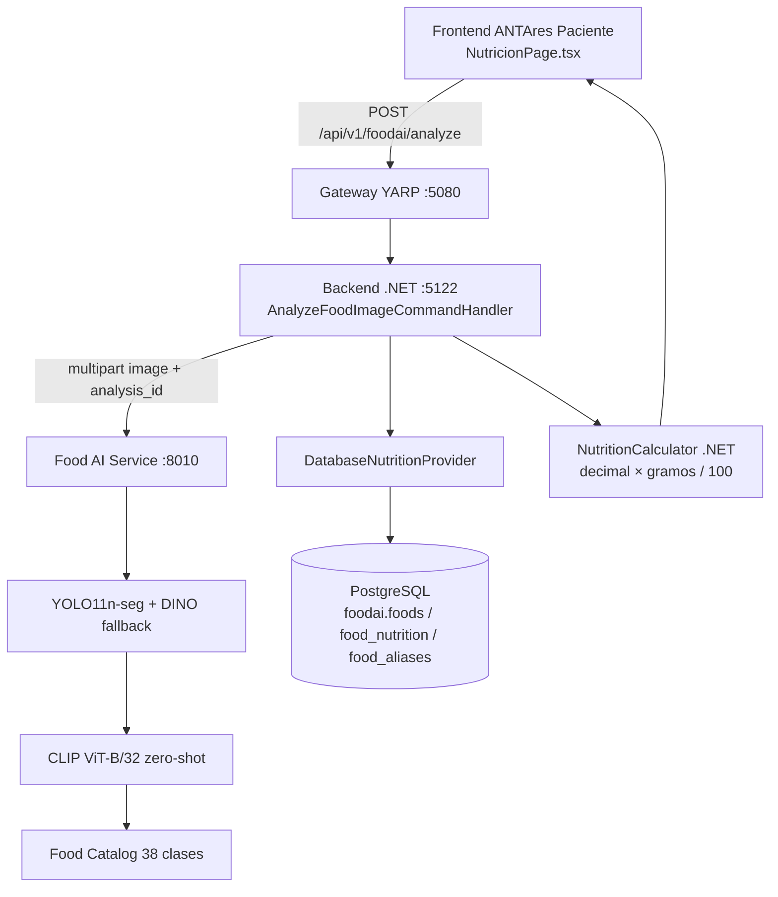
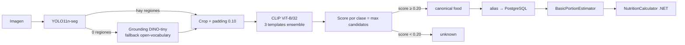
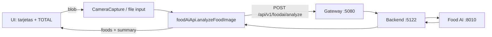
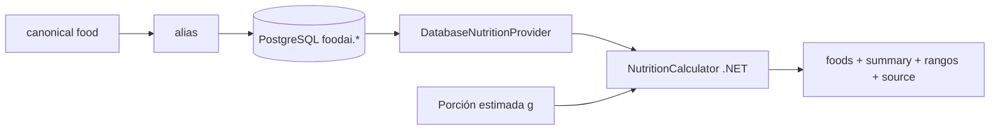
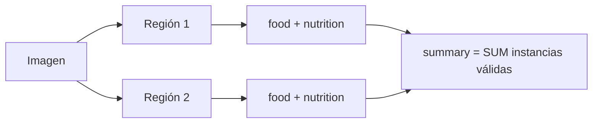
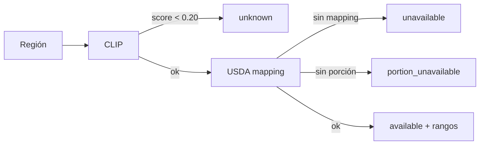

# Food AI Service

Servicio de IA de análisis de alimentos del ecosistema **COPP-ADRESD / ANTARES Biohacking**.

Recibe una fotografía de comida y devuelve: alimentos identificados, porción estimada y nutrición (calorías, macros, rangos, fuente USDA). Es el componente de visión del flujo: **foto → alimento → nutrición**.

Python 3.12+ / FastAPI. Puerto **8010** (el 8000 lo ocupa `ai-service/`).

---

## 1. Qué es este proyecto

### En lenguaje simple

El usuario toma una foto de su comida con el celular. El sistema identifica qué alimentos hay en la foto (pizza, hamburguesa, papas fritas…), estima cuánto pesa cada porción y devuelve las calorías y macros con su fuente (USDA). El usuario ve el resultado en la app.

### En lenguaje técnico

Pipeline de visión por computadora:

```
imagen
→ detección de regiones (YOLO11n-seg)
→ fallback open-vocabulary (Grounding DINO-tiny)
→ crops por región (padding 0.10)
→ clasificación zero-shot (CLIP ViT-B/32 + ensemble de prompts)
→ score por clase (máximo de candidatos)
→ Food Catalog (38 clases)
→ alias → PostgreSQL (foodai.*)
→ estimación de porción (BasicPortionEstimator)
→ cálculo nutricional (NutritionCalculator .NET, backend)
→ respuesta API
```

Este servicio NO es una base nutricional. Identifica alimentos. La nutrición la aporta **USDA FoodData Central** (importada a PostgreSQL), la porción la estima `BasicPortionEstimator` y el cálculo final (`nutriente × gramos / 100`) lo hace el **backend .NET**.

---

## 2. Qué problema resuelve

"Tomar una foto de comida y obtener información nutricional estimada y trazable."

Aclaraciones importantes:

- La IA **identifica** alimentos (visión).
- **USDA** proporciona los datos nutricionales (fuente de verdad, `source/sourceVersion/sourceId`).
- La **porción** es una estimación (nunca un peso medido).
- El **NutritionCalculator .NET** calcula los valores finales (el servicio Python NO calcula nutrición).
- El servicio responde **honestamente** cuando no puede: `unknown`, `unavailable`, `portion_unavailable` — nunca inventa valores.

---

## 3. Arquitectura general



Flujo real de un análisis (verificado): `NutricionPage.tsx` → gateway `:5080` → API `:5122` → food-ai `:8010` → respuesta con nutrición.

---

## 4. Pipeline de IA



### 4.1 Input

`POST /analyze` (interno, consumido por el backend .NET): `multipart/form-data` con `image` (JPEG/PNG/WebP, máx. 10 MB) y `analysis_id` (UUID).

### 4.2 YOLO11n-seg

Detector de regiones COCO (80 clases, incluye pizza/hot dog/sandwich…). Produce **bounding boxes** (rectángulo x,y,w,h en píxeles) y **máscaras de segmentación** (binarias, base64) cuando la región es de una clase segmentable. Rápido (~80-130 ms) pero limitado a sus clases de entrenamiento y a fotos "limpias".

### 4.3 Grounding DINO (fallback)

Detector **open-vocabulary** (puede buscar cualquier texto, en este caso `"food on a plate"`). Se ejecuta SOLO cuando YOLO no encuentra regiones. Resuelve el problema de YOLO con fotos reales (fondos complejos, alimentos fuera de COCO). Es lento (~10-17 s en CPU), por eso es fallback y no el detector principal. El resultado se filtra con NMS (IoU 0.5).

### 4.4 Cropping

Cada región se recorta de la imagen con **padding 0.10** (10% del tamaño del bbox por lado) para incluir un poco de contexto. Verificado experimentalmente como el mejor padding (FASE 17): padding 0.0 y masked crop degradan.

### 4.5 CLIP ViT-B/32 (zero-shot)

CLIP aprende a alinear imágenes y texto en un espacio de **embeddings** común. Zero-shot = clasifica sin entrenar para nuestras clases: compara el **embedding de la imagen** (el crop) contra los **embeddings de texto** de los candidatos del catálogo y toma el más similar. El score es la similitud coseno normalizada.

**Ensemble actual (3 templates)**: `"a photo of {food}"`, `"a picture of {food}"`, `"a close-up photo of {food}"` — se promedian los scores por candidato (mejora top-1 vs una sola plantilla).

### 4.6 Score por clase

Varias clases tienen varios candidatos de texto (ej. `french_fries`: "french fries", "fries", "thin fried potato strips", "long golden potato sticks"). El **score de la clase = máximo de sus candidatos** (no el promedio): esto recuperó `hot_dog` (13/20) en FASE 16 sin degradar el resto. El ranking final es por clase.

### 4.7 Unknown (threshold)

Si el mejor score por clase es **< 0.20** (`FOOD_AI_CLIP_THRESHOLD`), la detección se clasifica `unknown` → el backend responde `portion_unavailable`/sin nutrición para esa región. Nunca se inventa la identidad.

---

## 5. Food Catalog

`app/models/food_catalog.py` — **38 clases** actuales (canonical, candidatos CLIP, categoría, nutrition_key). El catálogo define las clases que la aplicación intenta mapear a nutrición. Ver catálogo completo con `python scripts/audit_catalog.py`.

> **IMPORTANTE**: "38 alimentos" es el catálogo de la APLICACIÓN, no un límite del modelo CLIP. CLIP puede reconocer muchísimos más conceptos; nosotros elegimos estas 38 clases. Ampliar el catálogo = añadir entrada + candidatos + mapping USDA + referencia de porción + evaluación (ver §27).

Cadena de identidad→nutrición:

```
CLIP canonical (ej. "hot_dog")
→ alias normalizado ("hot dog", "hot_dog")
→ PostgreSQL foodai.food_aliases → foodai.foods → foodai.food_nutrition
→ NutritionCalculator .NET
```

Agregar una clase visual NO implica que exista nutrición: el mapping USDA es un paso independiente (35/38 tienen).

---

## 6. USDA FoodData Central

**USDA FDC** = base de datos nutricional oficial del gobierno de EE. UU. (fdc.nal.usda.gov). Proporciona valores por 100 g con trazabilidad: `fdc_id`, `fdc_name`, `data_type` (SR Legacy / FNDDS / Foundation / Branded).

Estados de mapping:

| Estado | Significado |
|---|---|
| `DIRECT_MATCH` | Equivalencia directa y confiable |
| `GOOD_EQUIVALENCE` | Equivalencia genérica razonable (documentada) |
| `REVIEW_REQUIRED` | Sin equivalencia defendible aún |
| `NO_RELIABLE_MATCH` | Sin equivalencia genérica defendible (sandwich, soup, cereal) |

**La API de USDA se usa para IMPORTAR datos, nunca en el runtime.** El runtime consulta PostgreSQL:

```mermaid
flowchart LR
    USDA[USDA API key] -->|scripts/import_usda_foods.py --sync| CUR[JSON curado<br/>coppAddresdBack Seeders/data/food_usda_curated.json]
    CUR --> SEED[FoodAiNutritionSeeder .NET]
    SEED --> PG[(PostgreSQL foodai.*)]
    PG --> LOOKUP[DatabaseNutritionProvider (runtime)]
```

Cobertura actual: **35/38 = 92.1%** con nutrición confiable (21 DIRECT_MATCH + 14 GOOD_EQUIVALENCE). `sandwich`, `soup`, `cereal` sin mapping defendible (se responden honestamente como `unavailable`).

---

## 7. Nutrition Database (PostgreSQL)

Schema `foodai.` (backend .NET, EF Core):

- `foodai.foods` — alimento canónico + display name.
- `foodai.food_aliases` — aliases (normalización `_`→espacio, hot_dog→"hot dog").
- `foodai.food_nutrition` — valores por 100 g + `source` ("USDA FoodData Central"), `sourceVersion`, `sourceId` (fdc_id).

**PostgreSQL es la fuente de verdad nutricional del runtime.** El backend la consulta con `DatabaseNutritionProvider`; el food-ai NO tiene copia de la nutrición.

---

## 8. Portion Estimation

`app/models/basic_portion_estimator.py` — `BasicPortionEstimator`:

1. Referencia por alimento: gramos de UNA porción doméstica típica según USDA (`REFERENCE_GRAMS`, 35 alimentos con FDC ID).
2. Tamaño visual: área relativa de la máscara (o bbox) → `small`/`medium`/`large` (umbrales fijos documentados).
3. Gramos: `estimated = base × factor(tamaño)`; `min/max` = rango alrededor.

Esto es una **estimación heurística**, nunca un peso medido (sin escala física). `confidence` fija 0.55. Sin referencia → `portion_unavailable`.

---

## 9. Nutrition Calculation (backend .NET)

El cálculo final vive en `NutritionCalculator` (.NET, decimal):

```
nutrition_for_portion = nutrition_per_100g × estimated_grams / 100
```

Con rangos: `nutritionRange.min/max` = rango de gramos (min/max) aplicado a la misma fórmula. El frontend y el food-ai NO calculan nutrición: el backend es la única calculadora.

---

## 10. Integración con el backend .NET

Archivos del backend involucrados (repo `coppAddresdBack/`, proyecto `CoppAddresd.Api` + `Application` + `Infrastructure`):

- `src/CoppAddresd.Api/Controllers/FoodAiController.cs` — endpoints.
- `src/CoppAddresd.Application/Features/FoodAi/AnalyzeFoodImageCommandHandler.cs` — orquestación: validación de imagen → storage → `IFoodAiClient.SendImageAsync` → nutrición por alimento → summary → persistencia (`FoodAnalysis` snapshot).
- `src/CoppAddresd.Infrastructure/Services/FoodAiClient.cs` + `IFoodAiClient.cs` — cliente HTTP multipart.
- `src/CoppAddresd.Api/Seeders/FoodAiNutritionSeeder.cs` + `Seeders/data/food_usda_curated.json` — carga nutricional.
- Config: `appsettings.json` → `FoodAi:BaseUrl=http://localhost:8010`, `TimeoutSeconds=60`, `MaxImageSizeBytes=10MB`.

Contrato backend → food-ai:

| | |
|---|---|
| Endpoint | `POST /analyze` (interno) |
| Método | `POST` |
| Body | `multipart/form-data` |
| Campos | `image` (archivo) + `analysis_id` (UUID) |
| Auth | ninguna (solo alcanzable vía el backend) |
| Timeout | 60 s (soporta DINO fallback 10-17 s) |
| Errores | 400/413/422 con `{"error": {...}}`; el backend los mapea a `FoodAiException` → 502 |

Endpoint público del backend: `POST /api/v1/foodai/analyze` (AllowAnonymous, multipart `image`).

---

## 11. Integración con el frontend

Repo `antares-paciente/` (React 19 + Ionic 8.8 + Vite):

- `src/utils/foodAiApi.ts` — cliente del análisis (fetch multipart, tipado, timeout 60 s, mensajes de error en español).
- `src/components/CameraCapture.tsx` — cámara (`getUserMedia`, cámara trasera) + fallback a selección de archivo; detiene los tracks al capturar/desmontar.
- `src/pages/NutritionPage.tsx` — estados IDLE → CAMERA → ANALYZING (animación) → SUCCESS/ERROR; tarjetas por alimento + total.



---

## 12. API contract (backend público)

**Request** — `POST /api/v1/foodai/analyze`, `multipart/form-data`:

```
image: <archivo jpg/png/webp>
analysis_id: <uuid opcional>
```

**Response success** (real, pizza_001):

```json
{
  "analysisId": "…", "status": "completed",
  "foods": [{
    "name": "pizza", "confidence": 0.28,
    "boundingBox": {"x":127,"y":448,"width":525,"height":493},
    "portion": {"portionSize":"small","estimatedGrams":86,"minGrams":64,"maxGrams":96,"confidence":0.55,"method":"basic_reference"},
    "nutrition": {"calories":228.76,"protein":9.80,"carbohydrates":28.66,"fat":8.94,"fiber":1.98,"sugar":3.10,"sodium":514.28},
    "nutritionRange": {"min":{…},"max":{…}},
    "nutritionStatus": "available",
    "source": "USDA FoodData Central", "sourceVersion": "2026-08-27", "sourceId": null
  }],
  "summary": {"calories":228.76,"protein":9.80,"carbohydrates":28.66,"fat":8.94,"fiber":1.98,"sugar":3.10,"sodium":514.28},
  "summaryRange": {"min":{…},"max":{…}}
}
```

**Multi-food** (real, mf_003 — 2 hamburguesas): dos entradas `foods` (hamburger 62 g / 184.14 kcal ×2) y `summary.calories = 368.28`.

**Unavailable** (sandwich): `"nutritionStatus": "unavailable"`, `nutrition: null` → el frontend muestra "Identificamos este alimento, pero no tenemos información nutricional disponible".

**Errores**: 400 (imagen inválida/empty/too large), 413, 422, 502 (food-ai caído). Cuerpo de error: `{"error": {"code": "...", "message": "..."}}`.

---

## 13. Multi-food

- Cada región detectada se clasifica y se procesa por separado.
- Cada alimento con nutrición contribuye al `summary` (SUM de instancias válidas).
- Verificado en E2E real: `hamburger ×2` → 2 instancias → 2 × 184.14 = **368.28 kcal** en el summary.
- Protección de duplicados: deduplicación espacial (ver §14). NO existe el cap "máximo 1 por clase".

---

## 14. Deduplication

Problema: DINO/YOLO generan varias regiones del mismo alimento (plato + caja interna + subregión) → doble conteo.

Mecanismos (en `zero_shot_classifier.py`):

1. **NMS** en regiones DINO (IoU 0.5).
2. **IoU > 0.3** entre detecciones de la misma clase → conservar la mejor.
3. **Contención** (≥70% del área menor dentro de la mayor) → eliminar la envolvente (plato).
4. **Centro-contención** (centro de la menor dentro de la mayor + ≥30% de área) → mismo objeto fragmentado (pan+bollo).

Instancias separadas reales (IoU ~0) se conservan: 2 huevos, 2 hamburguesas. **Limitación conocida**: regiones dispersas del mismo objeto con IoU < 0.3 (ej. mf_000) pueden quedar como 2 instancias — sin fix con evidencia en 2D.

---

## 15. Modelos

| Modelo | Función | Cuándo | Latencia CPU | Licencia | Estado |
|---|---|---|---|---|---|
| YOLO11n-seg | Detección + segmentación | siempre (primero) | ~80-130 ms | AGPL-3.0 | PRODUCCIÓN |
| Grounding DINO-tiny | Detección fallback open-vocabulary | solo si YOLO = 0 regiones | ~10-17 s | Apache-2.0 | PRODUCCIÓN |
| CLIP ViT-B/32 | Clasificación zero-shot | siempre | ~80-120 ms/crop | MIT | PRODUCCIÓN |

Evaluados y **descartados** (no producción): DINOv3 Food ViT-L (top1 food-us 55.6% vs CLIP 58.3%, unknown alto, 6× más lento — licencia Apache-2.0), BEiT Food 384 (32.4%, MIT). Detalle: `docs/pretrained-model-evaluation.md`.

---

## 16. Performance

| Etapa | p50 | p95 |
|---|---|---|
| YOLO | 78 ms | 115 ms |
| DINO fallback | 11.8 s | 13.8 s |
| CLIP | ~100 ms/crop | — |
| Fast path total | ~0.4-0.6 s | — |
| Con fallback DINO | ~13-17 s | — |
| Memoria food-ai | ~1.3 GB WS (oscila, no lineal) | — |

- **Fast path**: YOLO detecta → ~0.5 s.
- **DINO fallback**: 33.3% de imágenes en food-us, 55.6% en food-bench-v1 (fotos reales).
- Concurrencia: la inferencia CPU está **serializada** (semáforo asyncio) — torch en CPU crashea con DINO concurrente. 100 requests secuenciales OK; concurrencia ≤4 por réplica con latencias crecientes (cola).

---

## 17. Production configuration

```bash
FOOD_AI_DETECTOR_TYPE=hybrid        # yolo | dino | hybrid
FOOD_AI_CLASSIFIER_TYPE=zero_shot
FOOD_AI_CLIP_THRESHOLD=0.20
FOOD_AI_CLIP_CROP_PADDING=0.10
FOOD_AI_CLIP_PROMPT_TEMPLATE=a photo of {food}
FOOD_AI_CLIP_PROMPT_ENSEMBLE=a picture of {food}|a close-up photo of {food}
FOOD_AI_PORTION_METHOD=basic
FOODAI_USDA_API_KEY=<YOUR_KEY>      # solo import; nunca en logs/código
```

---

## 18. Project structure

```
food-ai-service/
├── app/
│   ├── api/            # routers FastAPI (analyze, health)
│   ├── core/           # Settings (pydantic-settings, env FOOD_AI_*)
│   ├── models/         # YOLO, DINO hybrid, segmenter, CLIP, portion, catálogo
│   ├── schemas/        # contratos Pydantic
│   ├── services/       # porción geométrica
│   └── utils/          # debug
├── scripts/            # herramientas de desarrollo (benchmarks, USDA, estabilidad)
├── tests/              # pytest (assets: pizza/banana/apple)
├── datasets/
│   ├── food-us-v0.1/   # benchmark histórico (108 imágenes, 6 clases)
│   ├── food-bench-v1/  # benchmark ampliado (248, 31 clases, Wikimedia Commons)
│   ├── multi-food/     # benchmark multi-food (16, GT por instancia)
│   └── food101-subset/ # evaluación interna Food-101 (3500, 14 clases)
├── benchmarks/
│   ├── classification/ # resultados CLIP/Food-101/v1/hybrid
│   ├── detection/      # regions.json (detección precalculada food-us)
│   ├── nutrition/      # food_coverage_report.json
│   ├── multifood/      # multifood_results.json
│   └── history/        # resultados de fases anteriores (F14-F22)
├── docs/               # documentación técnica por tema
├── weights/            # modelos .pt (gitignored)
├── run_dev.py          # dev server (SelectorEventLoop, Windows)
├── requirements.txt / requirements-dev.txt
└── Dockerfile
```

---

## 19. Installation

```bash
cd food-ai-service
python -m venv .venv
.\.venv\Scripts\pip install -r requirements-dev.txt

# Modelos (primera vez — gitignored)
mkdir weights
curl -L -o weights/yolo11n.pt https://github.com/ultralytics/assets/releases/download/v8.3.0/yolo11n.pt
curl -L -o weights/yolo11n-seg.pt https://github.com/ultralytics/assets/releases/download/v8.3.0/yolo11n-seg.pt
# (CLIP y DINO se descargan automáticamente de Hugging Face al primer arranque)

# .env (copiar de .env.example; FOODAI_USDA_API_KEY solo para importar)
```

Dependencia externa: backend .NET (`coppAddresdBack`) + PostgreSQL (schema `foodai.`). El food-ai solo necesita el backend para nutrición; para desarrollo del pipeline puede correr solo (los foods sin nutrición aparecen como `unavailable`).

## 20. Development

```bash
.\.venv\Scripts\python run_dev.py        # dev server :8010 (Windows: SelectorEventLoop)
.\.venv\Scripts\python -m pytest -q      # 72 tests
.\.venv\Scripts\python scripts/benchmark_e2e.py            # E2E food-us (59.3%)
.\.venv\Scripts\python scripts/audit_catalog.py            # matriz catálogo
.\.venv\Scripts\python scripts/benchmark_multifood_v2.py   # multi-food por instancia
.\.venv\Scripts\python scripts/stability_check.py 100 90   # estabilidad secuencial
```

> Windows: NO usar `uvicorn app.main:app` directo (ProactorEventLoop rompe psycopg async); `run_dev.py` fuerza `SelectorEventLoop`.

## 21. Tests

`tests/` (pytest, 72 tests):

- Unidad: clasificador zero-shot (dedup espacial, scoring), porción (referencias), detector YOLO, segmentador, hybrid (NMS).
- Integración local: `test_analyze.py` con fakes (sin modelos reales).
- `test_zeroshot_real.py` — requiere CLIP real (descargado automáticamente).
- Los benchmarks NO son tests (viven en `scripts/` + `benchmarks/`).
- PostgreSQL NO se requiere para pytest (los tests de integración del backend viven en `coppAddresdBack/tests/CoppAddresd.IntegrationTests`).

## 22. Health check

```http
GET /health
```
```json
{"status":"healthy","service":"food-ai-service","version":"0.1.0","timestamp_utc":"…"}
```

`healthy` = el servicio responde. Los modelos se cargan en el lifespan (startup): si un modelo falla al cargar, el arranque lo registra (el servicio arranca con lo disponible). El backend expone `GET /api/v1/foodai/health` → `{backend, foodAI}` para el probe completo.

## 23. Observability

Log estructurado por análisis (sin imágenes, sin API keys, sin JWT, sin PII):

```
análisis_completo analysis_id=… foods_detected=N foods_classified=N foods_unknown=N
food_instance_count=N used_dino_fallback=true detector_ms=… segmentation_ms=…
classification_ms=… portion_ms=… total_ms=… status=completed
```

Backend (.NET): `nutrition_resumen analysis_id=… foods=… nutricion_ok=X/Y nutrition_items_total/available/unavailable/mapping_missing/… fallos=…`.

## 24. Error handling

| Situación | Respuesta |
|---|---|
| score < threshold | `unknown` → sin nutrición |
| sin mapping nutricional | `nutritionStatus: "unavailable"` |
| sin referencia de porción | `portion_unavailable` |
| imagen inválida/vacía/grande | 400 / 413 (código + mensaje) |
| food-ai caído | backend → 502 (`FoodAiException`) |
| timeout (60 s) | backend → 502/504 controlado |
| USDA import falla | el importador reporta error; el runtime no depende de la API |

Nunca: hang infinito (timeouts), 500 sin contexto, información nutricional inventada.

## 25. Current metrics

| Métrica | Valor | Denominador |
|---|---|---|
| E2E food-us (108 imágenes) | **59.3%** | imágenes con nutrición completa |
| Classification food-us | 70.4% (76/108) | imágenes clasificadas correctas |
| Food-101 (evaluación interna) | 89.4% top-1 | 3500 imágenes |
| food-bench-v1 (fotos reales) | 47.0% top-1 | 247 imágenes |
| USDA coverage | 35/38 (92.1%) | catálogo |
| Portion coverage | 35/38 (92.1%) | catálogo |
| Multi-food recall / precision | 56.5% / 52.0% | 23 instancias GT |
| Duplicates multi-food | 1 | — |
| DINO fallback food-us / v1 | 33.3% / 55.6% | imágenes |
| Estabilidad secuencial | 100/100 | requests |
| Concurrencia (semáforo) | 50×2, 50×4 OK | requests |

No mezclar denominadores: `food-us` (banco, 6 clases) ≠ `food-bench-v1` (fotos reales, 31 clases) ≠ `Food-101` (14 clases del catálogo).

## 26. Limitations

- Catálogo limitado a **38 clases** (ver §27).
- `sandwich`, `soup`, `cereal` sin mapping nutricional defendible → `unavailable`.
- CLIP confunde alimentos visualmente similares: fries/fried_chicken→rice (estructural, sin fix con crops/prompts), pancakes vs waffles (mejorado con candidatos descriptivos en F21-F22).
- Multi-food recall 56.5% (instancias perdidas en platos complejos).
- DINO fallback lento (10-17 s) en 33-56% de fotos reales; CPU-bound.
- Porción = estimación heurística (sin escala física).
- Benchmarks: food-bench-v1 con ruido residual (imágenes por título de Wikimedia); GT multi-food provisional (evidencia espacial, sin revisión visual completa).

## 27. Por qué 38 alimentos NO es el límite del modelo

**CLIP no está físicamente limitado a 38 alimentos.** CLIP conoce decenas de miles de conceptos. El catálogo contiene 38 clases porque **nosotros definimos esas 38** como las que la aplicación intenta mapear a nutrición.

La diferencia:

- "El modelo reconoce 38" — falso: el modelo es zero-shot y general.
- "La aplicación soporta 38 clases" — verdadero: el catálogo + candidates + USDA mapping + porciones cubren 38.

Crecer a 100/200+ alimentos = ampliar 4 piezas independientes:

```
Food Catalog (entrada + candidates de texto)
+ USDA mapping (import con la API + revisión)
+ REFERENCE_GRAMS (porción)
+ evaluación (dataset por clase)
```

NO necesariamente entrenar/fine-tuning (no hay evidencia de que haga falta — los modelos pretrained genéricos perdieron contra CLIP en el A/B).

## 28. Roadmap

**CURRENT / PRODUCTION**: pipeline actual (F22-F23 validado: E2E 59.3%, estabilidad 100/100, semáforo de concurrencia). Demo frontend integrada (NutricionPage → backend → food-ai → USDA).

**FUTURE** (no implementado, sin orden de prioridad):

1. Ampliación del catálogo a 100+ alimentos (proceso §27).
2. Ampliación a 200+.
3. Mejor clasificación de alimentos visualmente similares (fries/fried_chicken→rice).
4. Mejor multi-food (recall/instancias).
5. Mejor estimación de porción (Nutrition5k CC BY 4.0 con masa real, depth).
6. Evaluar fine-tuning con dataset comercial/licenciado SOLO si hay evidencia de que aporta.

## 29. Datasets

| Dataset | Propósito | Tamaño | Licencia | Producción |
|---|---|---|---|---|
| `food-us-v0.1` | Benchmark histórico | 108 img / 6 clases | interna (banco) | NO (evaluación) |
| `food-bench-v1` | Benchmark fotos reales | 248 / 31 clases | CC0/CC BY/CC BY-SA/PD (Commons) | NO (evaluación) |
| `multi-food` | Benchmark multi-food | 16 / GT instancias | interna | NO (evaluación) |
| `food101-subset` | **Evaluación interna** | 3500 / 14 clases | **NON-COMMERCIAL (ETH)** — nunca producción | NO |
| `tests/assets` | Assets de tests | 3 imágenes | interna | NO |

**Food-101: EVALUACIÓN INTERNA ÚNICAMENTE. NO usar en producción, no distribuir, no copiar al producto.**

## 30. Licenses

| Componente | Licencia | Uso comercial | Producción |
|---|---|---|---|
| YOLO11n (Ultralytics) | AGPL-3.0 | requiere consideración (AGPL) | candidato actual — evaluar para comercial |
| Grounding DINO-tiny | Apache-2.0 | sí | sí |
| CLIP ViT-B/32 (OpenAI) | MIT | sí | sí |
| USDA FDC data | CC0 (public domain) | sí | sí |
| Food-101 (ETH) | non-commercial research | NO | NO |
| Nutrition5k (Google) | CC BY 4.0 | sí (atribución) | solo evaluación por ahora |

> No afirmar licencias sin verificar en la fuente. La licencia AGPL de YOLO es una consideración comercial pendiente de decisión (alternativas: ONNX/otro detector con licencia permisiva).

## 31. Troubleshooting

- **food-ai no inicia**: verificar `.env`, `weights/` (yolo11n.pt, yolo11n-seg.pt), puerto 8010 libre (`Get-NetTCPConnection -LocalPort 8010`), y usar `run_dev.py` en Windows (SelectorEventLoop).
- **CLIP no carga**: primera vez descarga de Hugging Face (requiere red); verificar `HF_TOKEN` si hay rate limits.
- **DINO falla**: primera vez descarga del modelo; en CPU es lento (10-17 s) — no es error.
- **USDA import falla**: `FOODAI_USDA_API_KEY` vacía o inválida; el script reporta exactamente el error (401/429/red).
- **PostgreSQL falla**: el backend no arranca el seeder; verificar el servicio y `ConnectionStrings:DefaultConnection`.
- **Frontend 502**: el gateway (5080) o el API (5122) caídos — levantar la cadena completa (gateway requiere build previo: `dotnet build src/Services/CoppAddresd.Gateway`).
- **Análisis tarda demasiado**: DINO fallback (10-17 s) — esperar; el timeout del frontend es 60 s.
- **nutrition unavailable**: el alimento se identificó pero no tiene mapping USDA (sandwich/soup/cereal u otros).
- **unknown**: el score CLIP < 0.20 — foto difícil o alimento fuera del catálogo.

## 32. Deployment

**Se despliega**: food-ai-service (FastAPI, 1 worker por réplica) + backend .NET (API) + PostgreSQL (schema `foodai.` seeder).

**No se despliega**: Food-101, DINOv3/BEiT, depth como masa absoluta, cap 1/clase, el JSON de import como runtime.

Variables: las de §17 (la API key USDA solo para import, nunca en runtime).

Checklist:

1. `dotnet build` del backend + seeder (35 alimentos).
2. Levantar food-ai (`run_dev.py` o uvicorn) con `FOOD_AI_*` del §17.
3. `GET /api/v1/foodai/health` → `{backend: healthy, foodAI: healthy}`.
4. Humo: `POST /api/v1/foodai/analyze` con pizza → 228.76 kcal con rangos.
5. 1 worker por réplica CPU (inferencia serializada); escalar réplicas para throughput.
6. Monitorear: WS del food-ai (~1.3 GB), latencia DINO (10-17 s en 33-56% de requests), logs `análisis_completo`.

## 33. Architecture diagrams

Ver diagramas en §3 (general), §4 (pipeline IA), §6 (USDA import), §11 (frontend), y:

**Flujo nutricional**:



**Multi-food**:



**Error/unavailable**:



## 34. Glossary

- **AI / ML**: sistemas que aprenden de datos para reconocer patrones (aquí: imágenes).
- **Inference**: ejecutar un modelo entrenado sobre datos nuevos (una foto).
- **Model**: red neuronal con pesos entrenados (YOLO, DINO, CLIP).
- **YOLO**: detector de objetos en una sola pasada, rápido.
- **Bounding box**: rectángulo que enmarca un objeto detectado (x, y, ancho, alto).
- **Segmentation (mask)**: máscara binaria que marca los píxeles del objeto.
- **Grounding DINO**: detector open-vocabulary (detecta lo que el texto describa).
- **Open vocabulary**: detecta/clasifica clases NO vistas en entrenamiento vía texto.
- **CLIP**: modelo que alinea imágenes y texto en un espacio común.
- **Embedding**: vector numérico que representa el significado de una imagen/texto.
- **Zero-shot**: clasificar clases nunca entrenadas, solo describiéndolas.
- **Prompt**: texto que describe la clase ("a photo of pizza").
- **Candidate**: cada prompt/clase candidata del catálogo.
- **Score**: similitud entre la imagen y el candidato (0-1 aprox.).
- **Threshold**: mínimo de score para aceptar una clase (0.20).
- **Confidence**: score de confianza del clasificador/detector.
- **Dataset**: colección de imágenes etiquetadas para evaluar.
- **Benchmark**: evaluación estandarizada con métricas.
- **USDA / FDC**: base nutricional oficial de EE. UU. (FoodData Central).
- **FDC ID**: identificador único de un alimento en USDA.
- **Nutrition mapping**: equivalencia clase visual → alimento USDA con valores.
- **Portion estimation**: estimación de gramos de una porción (heurística).
- **NMS**: Non-Maximum Suppression — elimina cajas duplicadas del mismo objeto.
- **IoU**: intersección sobre unión de dos cajas (mide solape).
- **Fallback**: alternativa cuando el componente principal falla (DINO si YOLO no detecta).
- **E2E**: end-to-end — flujo completo desde la foto hasta la respuesta nutricional.

---

*Documentación generada en la FASE 24 (estado real verificado contra el código). Los reportes detallados por fase viven en `docs/roadmap.md` y `docs/` por tema.*